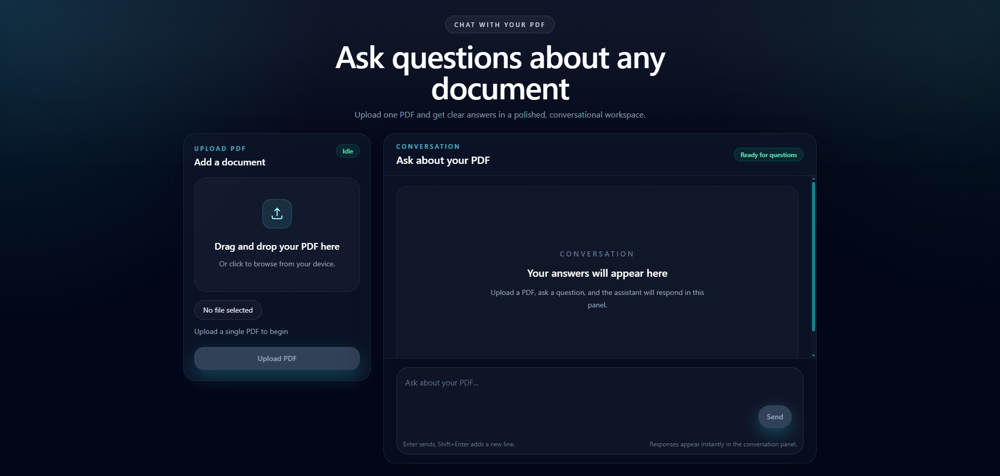

# Chat with PDF

AI-powered **Retrieval-Augmented Generation (RAG)** application that lets users upload a PDF and ask natural language questions about its contents.

## Live Demo

🔗 https://chat-with-pdf-one-self.vercel.app/

## Preview



---

## Features

- Upload a PDF document
- Automatic text extraction and chunking
- Semantic search using vector embeddings
- Context-aware answers powered by OpenAI
- FastAPI REST backend
- Modern React + Vite frontend
- Responsive chat interface

## Tech Stack

### Frontend
- React
- Vite
- JavaScript
- Tailwind CSS
- Axios

### Backend
- FastAPI
- Python
- LangChain
- ChromaDB
- OpenAI API *(or Gemini API if you've switched to Gemini)*
- PyMuPDF
- Uvicorn

## Project Flow

```text
Upload PDF
    ↓
Extract Text
    ↓
Split into Chunks
    ↓
Generate Embeddings
    ↓
Store in ChromaDB
    ↓
User Question
    ↓
Retrieve Relevant Chunks
    ↓
Create Prompt
    ↓
OpenAI LLM
    ↓
Answer Returned
```

## What I Learned

- Built a complete Retrieval-Augmented Generation (RAG) pipeline.
- Learned document chunking and semantic search using embeddings.
- Worked with LangChain and ChromaDB for retrieval.
- Designed prompts to generate grounded responses.
- Built REST APIs using FastAPI.
- Integrated a React frontend with a Python backend.
- Improved debugging, API integration, and project architecture skills.

## Future Improvements

- Authentication
- Multiple PDF support
- Chat history
- Streaming responses
- Per-user document collections
- Docker deployment
- Cloud storage support
